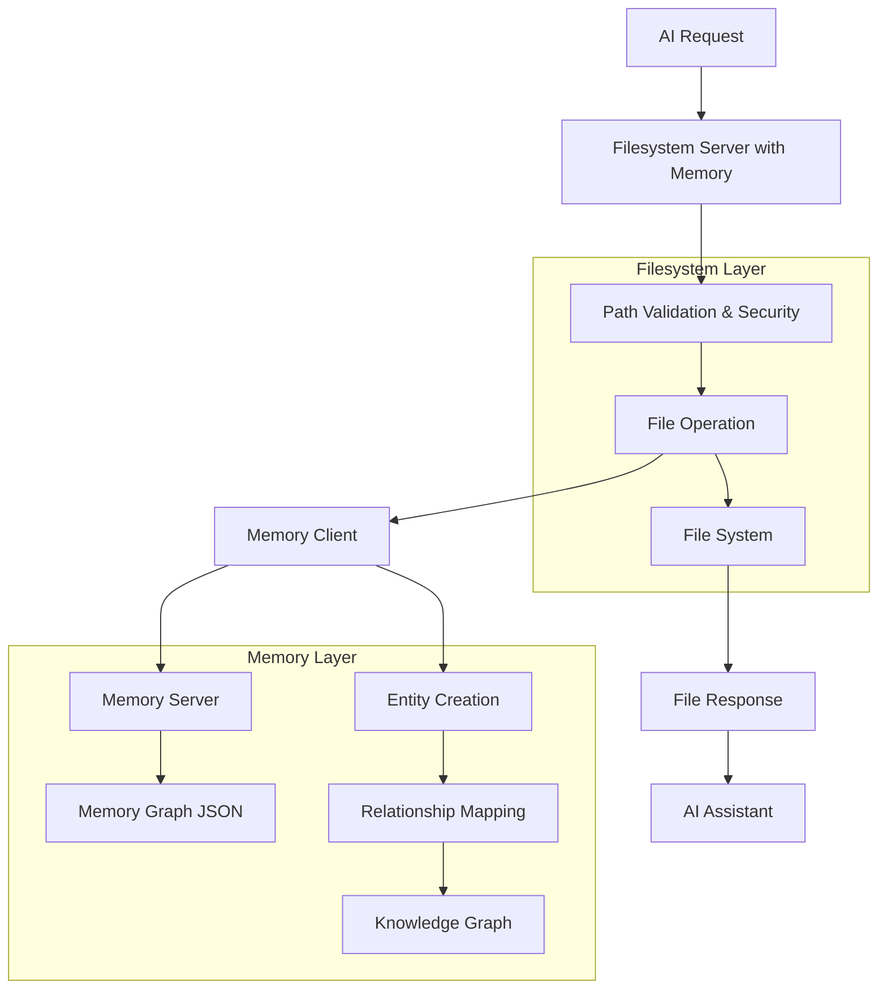
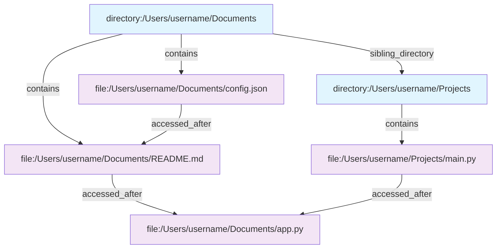

# Memory Integration Technical Deep Dive

This document provides a comprehensive technical explanation of how the memory-enhanced filesystem server works, including architecture, implementation details, and real-world AI scenarios.

## 🏗 Integration Architecture



## 🔄 Dual Operation Pattern

Every filesystem operation follows this precise pattern:

```typescript
async readFile(filePath: string) {
  // 1. Security validation (same as basic server)
  const validatedPath = this.validatePath(filePath);
  
  // 2. Perform the actual file operation
  const content = await fs.readFile(validatedPath, 'utf-8');
  
  // 3. Remember this operation in memory (NEW!)
  await this.rememberFileAccess(filePath, 'read', { 
    size: content.length,
    content: content
  });
  
  // 4. Return the result
  return content;
}
```

### Key Principles:
- **Security First**: Path validation happens before any memory operations
- **Non-Blocking**: Memory operations are asynchronous and don't slow file access
- **Comprehensive Tracking**: Every operation is remembered with rich metadata

## 🧠 Memory Entity System

### Entity Naming Convention

```typescript
// Files get prefixed with "file:"
const fileEntityName = `file:${filePath}`;           
// Example: "file:/Users/username/project/app.py"

// Directories get prefixed with "directory:"
const directoryEntityName = `directory:${dirPath}`;  
// Example: "directory:/Users/username/project"
```

### Rich Observation Tracking

Every file operation creates detailed observations:

```typescript
const observations = [
  `Operation: read`,                                    // What happened
  `Accessed at: 2024-01-15T14:30:00.000Z`,            // When it happened
  `File name: app.py`,                                 // File name
  `Directory: /Users/username/project`,               // Parent directory
  `Size: 1247 bytes`,                                 // File size
  `Content preview: import flask\nfrom flask import...` // First 200 chars
];
```

### Memory Entity Types

| Entity Type | Description | Example |
|-------------|-------------|---------|
| `filesystem_directory` | Represents allowed directories | `/Users/username/Documents` |
| `filesystem_file` | Represents accessed files | `/Users/username/Documents/app.py` |

## 🔗 Automatic Relationship Building

The system automatically creates relationships between entities:



### Relationship Types

| Relationship | Description | Example |
|--------------|-------------|---------|
| `contains` | Directory contains file | `directory:/projects` → `file:/projects/app.py` |
| `sibling_directory` | Directories with same access level | `directory:/docs` → `directory:/projects` |
| `accessed_after` | Temporal access relationships | `file:app.py` → `file:config.json` |

## 🕐 Temporal Intelligence Implementation

The system tracks **when** files are accessed to build usage patterns:

```typescript
private async rememberFileAccess(filePath: string, operation: string, metadata?: any) {
  // ... entity creation ...

  // Create temporal relationships
  const recentFiles = await this.memoryClient.searchNodes('filesystem_file');
  const recentlyAccessed = recentFiles.filter(f => 
    f.observations.some(obs => obs.includes('Accessed at:') && 
      new Date(obs.split('Accessed at: ')[1]) > new Date(Date.now() - 24 * 60 * 60 * 1000))
  );

  if (recentlyAccessed.length > 1) {
    await this.memoryClient.createRelation(
      fileEntityName, 
      recentlyAccessed[recentlyAccessed.length - 2].name, 
      'accessed_after'
    );
  }
}
```

This creates a **temporal graph** of file access patterns that the AI can use to understand your workflow.

## 🔍 Smart Memory Tools Deep Dive

### 1. `recall_file_history`

**Purpose**: Get complete access history for any file

```typescript
private async recallFileHistory(filePath: string): Promise<CallToolResult> {
  const fileEntityName = `file:${filePath}`;
  const fileNode = await this.memoryClient.openNode(fileEntityName);
  
  if (!fileNode) {
    return { content: [{ type: 'text', text: `No memory found for file: ${filePath}` }] };
  }

  return {
    content: [{
      type: 'text',
      text: JSON.stringify({
        file: filePath,
        entityType: fileNode.entityType,
        accessHistory: fileNode.observations,     // All operations ever performed
        relationships: fileNode.relations         // Connected files/directories
      }, null, 2)
    }]
  };
}
```

**Example Output**:
```json
{
  "file": "/Users/username/project/config.json",
  "entityType": "filesystem_file",
  "accessHistory": [
    "Operation: read",
    "Accessed at: 2024-01-15T10:30:00.000Z",
    "File name: config.json",
    "Directory: /Users/username/project",
    "Size: 342 bytes",
    "Content preview: {\n  \"api_key\": \"...\",\n  \"database\": {\n    \"host\": \"localhost\""
  ],
  "relationships": [
    {
      "from": "directory:/Users/username/project",
      "to": "file:/Users/username/project/config.json",
      "relationType": "contains"
    }
  ]
}
```

### 2. `find_similar_files`

**Purpose**: Semantic search across all stored file information

```typescript
private async findSimilarFiles(query: string, limit: number = 10) {
  const searchResults = await this.memoryClient.searchNodes(query);
  const fileResults = searchResults
    .filter(result => result.entityType === 'filesystem_file')
    .slice(0, limit);

  return {
    content: [{
      type: 'text',
      text: JSON.stringify({
        query,
        results: fileResults.map(result => ({
          filePath: result.name.replace('file:', ''),
          relevance: result.score,
          recentObservations: result.observations.slice(-3)
        }))
      }, null, 2)
    }]
  };
}
```

This searches across **all stored observations** including:
- File names
- Directory paths  
- Content previews
- Operation types
- Timestamps

### 3. `get_filesystem_memory_stats`

**Purpose**: Overview of tracked filesystem activity

```typescript
private async getFilesystemMemoryStats() {
  const graph = await this.memoryClient.readGraph();
  const fileEntities = Object.values(graph.entities).filter(e => e.entityType === 'filesystem_file');
  const dirEntities = Object.values(graph.entities).filter(e => e.entityType === 'filesystem_directory');
  
  const stats = {
    memoryEnabled: this.memoryEnabled,
    memoryFilePath: this.memoryFilePath,
    allowedDirectories: this.allowedDirectories,
    totalFilesTracked: fileEntities.length,
    totalDirectoriesTracked: dirEntities.length,
    totalMemoryEntities: Object.keys(graph.entities).length,
    recentlyAccessedFiles: fileEntities
      .filter(f => f.observations.some(obs => 
        obs.includes('Accessed at:') && 
        new Date(obs.split('Accessed at: ')[1]) > new Date(Date.now() - 24 * 60 * 60 * 1000)
      ))
      .length
  };

  return { content: [{ type: 'text', text: JSON.stringify(stats, null, 2) }] };
}
```

## 🚀 Performance & Efficiency

### Asynchronous Memory Operations

```typescript
// File operation happens immediately
const content = await fs.readFile(validatedPath, 'utf-8');

// Memory tracking happens in parallel (doesn't slow down file access)
await this.rememberFileAccess(filePath, 'read', { 
  size: content.length, 
  content 
});

// Response returned without waiting for memory operations
return { content: [{ type: 'text', text: content }] };
```

### Smart Content Limits

```typescript
// Only stores previews, not full content
if (metadata.content && operation === 'read') {
  const contentPreview = metadata.content.length > 200 
    ? metadata.content.substring(0, 200) + '...'
    : metadata.content;
  observations.push(`Content preview: ${contentPreview}`);
}
```

### Memory Efficiency

| Operation | Memory Impact | Storage Cost |
|-----------|---------------|--------------|
| File Read | ~500-800 bytes | Content preview + metadata |
| Directory List | ~200-400 bytes | Entry names + timestamps |
| File Search | ~300-600 bytes | Pattern + result summary |
| File Write | ~600-1000 bytes | Content preview + size info |

## 🎯 Real-World AI Scenarios

### Scenario 1: "What was I working on yesterday?"

**AI Request Flow**:
```
1. AI → get_filesystem_memory_stats
   Response: Overview including recentlyAccessedFiles count

2. AI → find_similar_files "accessed yesterday" 
   Response: Files with observations containing recent timestamps

3. AI → recall_file_history for each recent file
   Response: Detailed access patterns and relationships
```

**Memory Query**:
```typescript
// Find files accessed in last 24 hours
const recentFiles = fileEntities.filter(f => 
  f.observations.some(obs => 
    obs.includes('Accessed at:') && 
    new Date(obs.split('Accessed at: ')[1]) > new Date(Date.now() - 24 * 60 * 60 * 1000)
  )
);
```

### Scenario 2: "Find my Python files that use FastAPI"

**AI Request Flow**:
```
1. AI → find_similar_files "FastAPI python"
   Memory searches across:
   - File names containing "python" or ".py"
   - Content previews containing "FastAPI"
   - Directory paths suggesting Python projects

2. Results ranked by relevance score
3. AI can then recall_file_history for context
```

**Memory Search**:
```typescript
// Searches observations like:
// "Content preview: from fastapi import FastAPI\napp = FastAPI()..."
// "File name: main.py"
// "Directory: /Users/username/python-projects"
```

### Scenario 3: "Show me files related to config.json"

**AI Request Flow**:
```
1. AI → recall_file_history "/path/to/config.json"
   Response: All relationships and access history

2. AI uses relationships to find:
   - Parent directory (contains relationship)
   - Files accessed after config.json (accessed_after relationship)
   - Sibling files in same directory

3. AI → get_file_info for related files
   Response: Current state of related files
```

**Relationship Traversal**:
```typescript
// From config.json entity, find all related entities:
const relations = fileNode.relations;
const containingDir = relations.find(r => r.relationType === 'contains');
const accessedAfter = relations.filter(r => r.relationType === 'accessed_after');
```

## 🔒 Security & Privacy Implementation

### Sandboxing Maintained

```typescript
private validatePath(targetPath: string): string {
  const resolvedPath = path.resolve(targetPath);
  
  // Check if path is within allowed directories
  const isAllowed = this.allowedDirectories.some(allowedDir => {
    return resolvedPath.startsWith(allowedDir);
  });

  if (!isAllowed) {
    throw new Error(`Access denied: Path ${targetPath} is not within allowed directories`);
  }

  return resolvedPath;
}

private async rememberFileAccess(filePath: string, operation: string, metadata?: any) {
  if (!this.memoryEnabled) return;
  
  // Memory tracking only happens AFTER successful path validation
  // If validatePath() threw an error, we never get here
}
```

### Privacy Controls

```typescript
// Content preview limits
const contentPreview = metadata.content.length > 200 
  ? metadata.content.substring(0, 200) + '...'
  : metadata.content;

// Local-only storage
this.memoryFilePath = memoryFilePath || './filesystem-memory.json';

// No external network calls for memory operations
await this.memoryClient.connect(this.memoryFilePath); // Local file only
```

## 🔧 Implementation Details

### Memory Client Integration

```typescript
export class FilesystemServerWithMemory {
  private memoryClient: MemoryClient;
  private memoryEnabled: boolean = false;

  constructor(allowedDirectories: string[] = [], memoryFilePath?: string) {
    this.memoryClient = new MemoryClient();
    // ... setup ...
  }

  private async initializeMemory(): Promise<void> {
    try {
      await this.memoryClient.connect(this.memoryFilePath);
      this.memoryEnabled = true;
      await this.rememberAllowedDirectories();
    } catch (error) {
      console.error('Failed to initialize memory integration:', error);
      this.memoryEnabled = false; // Graceful fallback
    }
  }
}
```

### Error Handling Strategy

```typescript
private async rememberFileAccess(filePath: string, operation: string, metadata?: any) {
  if (!this.memoryEnabled) return; // Graceful skip if memory unavailable

  try {
    // ... memory operations ...
  } catch (error) {
    console.error('Failed to remember file access:', error);
    // Don't throw - memory failures shouldn't break filesystem operations
  }
}
```

## 📊 Data Flow Example

### Complete File Read Operation

```typescript
// 1. AI Request
AI: "Read the contents of /Users/username/project/config.json"

// 2. Security Validation
validatePath("/Users/username/project/config.json")
→ Checks against allowedDirectories
→ Returns validated path

// 3. File System Operation
const content = await fs.readFile(validatedPath, 'utf-8');
→ "{\n  \"api_key\": \"sk-...\",\n  \"database\": {\n    \"host\": \"localhost\"\n  }\n}"

// 4. Memory Recording (Parallel)
rememberFileAccess("/Users/username/project/config.json", "read", {
  size: 156,
  content: "{\n  \"api_key\": \"sk-...\",\n  \"database\": {\n    \"host\": \"localhost\"\n  }\n}"
})

// 5. Entity Creation
Entity: "file:/Users/username/project/config.json"
Type: "filesystem_file"
Observations: [
  "Operation: read",
  "Accessed at: 2024-01-15T14:30:00.000Z",
  "File name: config.json",
  "Directory: /Users/username/project", 
  "Size: 156 bytes",
  "Content preview: {\n  \"api_key\": \"sk-...\",\n  \"database\": {\n    \"host\": \"localhost\"\n  }\n}"
]

// 6. Relationship Creation
Relation: "directory:/Users/username/project" --contains--> "file:/Users/username/project/config.json"

// 7. Temporal Relationship (if applicable)
If previous file was accessed recently:
Relation: "file:/Users/username/project/config.json" --accessed_after--> "file:/Users/username/project/app.py"

// 8. Response to AI
Return: File contents + confirmation of memory tracking
```

## 🎉 Benefits Summary

The memory integration transforms a basic filesystem server into an **intelligent file assistant** that:

1. **Remembers Everything**: Every file operation with rich context
2. **Understands Relationships**: Files, directories, and temporal patterns  
3. **Enables Smart Discovery**: Content-aware and pattern-based file finding
4. **Maintains Security**: All safety guarantees of the basic server
5. **Performs Efficiently**: Non-blocking memory operations
6. **Scales Gracefully**: Handles large projects with intelligent storage limits

This creates a **personal knowledge graph** of your filesystem usage that makes your AI assistant incredibly context-aware while maintaining all security guarantees! 🧠✨ 